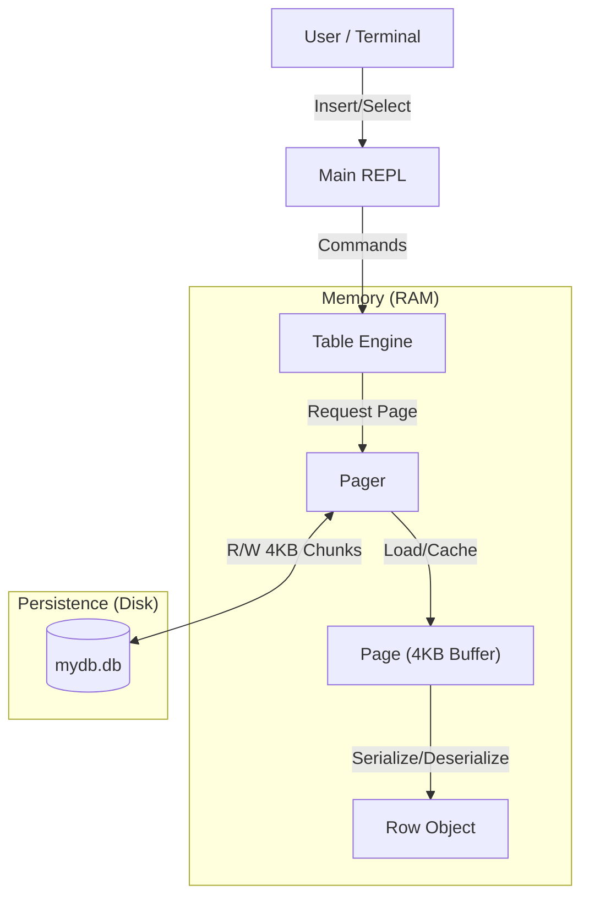

# PyMiniDB (Phase 1: The Foundation)

> **"데이터베이스의 본질(Why)을 이해하기 위한 여정"**
>
> 파이썬으로 바닥부터 구현해보는 교육용 미니 데이터베이스 엔진입니다.
> 직렬화(Serialization), 페이징(Paging), 디스크 영속성(Persistence)의 원리를 코드로 직접 구현하며 익힙니다.

---

## 🏗️ 아키텍처 개요 (Architecture Overview)

PyMiniDB는 전형적인 **Disk-Oriented Architecture**를 따릅니다.
파이썬 객체(RAM)와 파일 바이트(Disk) 사이의 간극을 명확한 계층 분리를 통해 연결합니다.



## 🧩 핵심 컴포넌트 (Core Components)

### 1. 데이터의 원자: `Row` (Data)
데이터의 최소 단위입니다. 일반적인 파이썬 객체와 달리, PyMiniDB의 Row는 **고정된 크기(Fixed Size)**를 가집니다. 이는 페이지 내에서 O(1) 시간 복잡도로 데이터 위치를 계산하기 위함입니다.

*   **스키마 (Schema)**:
    *   `id` (4 bytes, int)
    *   `username` (32 bytes, string)
    *   `email` (255 bytes, string)
*   **총 크기**: **291 Bytes**
*   **기술**: 파이썬의 `struct` 모듈과 리틀 엔디안(`lt;`) 포맷을 사용합니다.

### 2. 메모리 관리자: `Page` (Memory)
디스크 블록과 1:1로 대응되는 **4KB (4096 bytes)** 논리 단위입니다.
데이터베이스는 데이터를 스트림으로 저장하지 않고, 이렇게 페이지 단위로 나누어 관리합니다.

*   **구조**:
    *   **Header (9 bytes)**: 메타데이터 (`NumRows`, `PageType`, `FreeSpace`, `NextPageId`) 저장.
    *   **Body (4087 bytes)**: 약 14개의 Row 저장 가능.
*   **설계 경험**: "Header(9) + Body(4096)"로 인해 파일이 깨지는 정렬(Alignment) 문제를 겪었습니다. 이를 해결하기 위해 **Header를 4096바이트 규격 안에 포함**시키는 설계를 채택했습니다.

### 3. 디스크 인터페이스: `Pager` (Persistence)
파일 시스템과의 유일한 연결 통로입니다. DB 파일을 마치 '페이지들의 배열'처럼 다룹니다.

*   **기능**:
    *   `read_page(0)`: 0번 오프셋으로 이동(`seek`)하여 4096바이트를 읽음.
    *   `write_page(0)`: 4096바이트를 쓰고, 즉시 디스크에 동기화(`flush`).
*   **철학**: "파일 I/O는 OS에게 맡기고, 우리는 로직에 집중한다."

---

## 💾 바이너리 레이아웃 명세 (Binary Specification)

### Page Layout (Total 4096 Bytes)
```text
[ Header (9 Bytes) ] + [ Row 1 (291 Bytes) ] + [ Row 2 ] ... + [ Padding ]
```

### Header Format (`<HBHI`)
| Offset | Field | Type | Size | Description |
|--------|-------|------|------|-------------|
| 0 | **NumCells** | uint16 | 2 | 저장된 Row 개수 |
| 2 | **PageType** | uint8 | 1 | Leaf(0) 또는 Internal(1) |
| 3 | **FreeSpace** | uint16 | 2 | 빈 공간의 시작 오프셋 |
| 5 | **NextPageId** | uint32 | 4 | 다음 페이지 포인터 (Linked List) |

---

## 🔗 계층별 책임과 관계 (Layer Responsibilities & Relationships)

데이터베이스 엔진은 단순히 "데이터를 저장한다"는 목표를 여러 계층으로 분해하여, 각 계층이 **하나의 명확한 책임**만을 갖도록 설계됩니다. 이를 통해 복잡도를 관리하고, 각 모듈을 독립적으로 테스트하고 개선할 수 있습니다.

### 계층 구조 요약

```
[Schema] ← 데이터 구조 정의
    ↓
[Table] ← 논리적 집합 추상화 + 물리/논리 계층 중개
    ↓
[Cursor] ← 순회 상태 추적 (Iterator)
    ↓
[Page/Pager] ← 물리적 저장소 관리
    ↓
[Row] ← 데이터 직렬화 단위
```

### 1. Schema (스키마)
**추상화 대상:** 데이터 구조의 정의
**핵심 질문:** "어떤 속성과 제약이 있는가?"

스키마는 코드로 직접 구현되지 않지만, `Row` 클래스의 필드 정의와 `struct` 포맷 문자열로 표현됩니다. 관계형 데이터베이스에서 스키마는 Entity의 속성, 제약(Constraint), 관계(Relationship)를 구조화한 설계서입니다.

```python
# Row 클래스가 곧 스키마 정의
id: int           # 4 bytes
username: str     # 32 bytes
email: str        # 255 bytes
```

### 2. Table (테이블)
**추상화 대상:** Row의 논리적 집합
**핵심 질문:** "데이터를 어떻게 저장하고 가져올 것인가?"

Table은 **물리적 저장소(Page/Pager)와 논리적 데이터(Row) 사이의 중개자**입니다. 사용자는 "Row를 삽입해줘" 또는 "모든 Row를 가져와줘"라고 요청하지만, Table은 내부적으로 이를 "어느 Page에 쓸 것인가?", "몇 번째 오프셋에서 읽을 것인가?"로 변환합니다.

**책임:**
- Row 삽입/조회 로직 구현
- Pager를 통한 Page 로드/저장
- 스키마 제약 검증 (미래 구현)

**중요:** Table은 "데이터가 어떻게 물리적으로 배치되는지"를 알지만, Cursor는 모릅니다.

### 3. Cursor (커서)
**추상화 대상:** 순회 상태 (Traversal State)
**핵심 질문:** "지금 어디를 읽고 있는가?"

Cursor는 **Iterator Pattern**의 구현체로, Table이 관리하는 Row 집합 위를 순회하는 상태 추적 객체입니다. "다음 Row로 이동(advance)", "현재 Row 반환(value)", "끝에 도달했는가(end_of_table)"와 같은 연산을 제공합니다.

**책임:**
- 현재 위치 추적 (`page_num`, `row_num`)
- 순회 상태 관리 (`end_of_table`)
- Table에게 Row 요청 위임

**중요:** Cursor는 "Page를 로드하는 방법"을 모릅니다. 단지 Table에게 "이 위치의 Row를 달라"고 요청할 뿐입니다.

#### Cursor vs. Pointer

| 구분 | Pointer | Cursor |
|------|---------|--------|
| **대상** | 물리적 메모리 주소 | 논리적 데이터 집합 |
| **성격** | 정적 (Static) | 상태를 가진 흐름 (Stateful Iterator) |
| **추상화** | 하드웨어/메모리 계층 | 애플리케이션/비즈니스 로직 계층 |

Pointer는 "여기 메모리 주소 0x1234"라고 말하는 정적인 주소이지만, Cursor는 "현재 어디까지 읽었는지", "다음 데이터가 있는지"와 같은 **문맥(Context)을 들고 움직이는 객체**입니다.

### 4. Page/Pager (페이지/페이저)
**추상화 대상:** 물리적 저장소
**핵심 질문:** "디스크의 어느 위치에 쓸 것인가?"

- **Page:** 4KB 크기의 메모리 버퍼. 디스크 블록과 1:1 대응됩니다.
- **Pager:** 파일 시스템과의 인터페이스. `read_page(n)`, `write_page(n)`을 통해 디스크 I/O를 추상화합니다.

**책임:**
- 파일 오프셋 계산 (`page_num * 4096`)
- 디스크 읽기/쓰기 (`seek`, `read`, `write`, `flush`)
- 페이지 캐싱 (미래 구현)

**철학:** "파일 I/O는 OS에게 맡기고, 우리는 로직에 집중한다."

### 5. Row (로우)
**추상화 대상:** 데이터 직렬화 단위
**핵심 질문:** "이 데이터를 어떻게 바이트로 변환할 것인가?"

Row는 Python 객체를 C 호환 바이너리로 변환(`serialize`)하고, 바이너리를 다시 Python 객체로 복원(`deserialize`)하는 책임을 갖습니다. `struct` 모듈을 사용하여 플랫폼 독립적이고 고정된 크기의 바이트 표현을 보장합니다.

**책임:**
- 데이터 직렬화/역직렬화
- 필드 길이 검증
- 고정 크기 보장 (291 bytes)

---

### 계층 간 협력 예시: `SELECT` 실행 흐름

```python
# 1. 사용자 요청
table.execute_select()

# 2. Table: Cursor 생성
cursor = table.table_start()  # page_num=0, row_num=0

# 3. Cursor: 순회 시작
while not cursor.end_of_table:
    # 4. Cursor → Table: "현재 위치의 Row를 달라"
    row = cursor.value()

    # 5. Table → Pager: "0번 Page를 로드해줘"
    page = pager.read_page(cursor.page_num)

    # 6. Pager → Disk: seek(0 * 4096) + read(4096)
    # 7. Page → Row: deserialize(bytes)
    # 8. Row → Cursor → User: 반환

    print(row)
    cursor.advance()  # 다음 Row로 이동
```

### 핵심 원칙: 단일 책임 원칙 (SRP)

| 계층 | 알아야 할 것 | 몰라도 되는 것 |
|------|------------|---------------|
| **Table** | Pager의 존재, Row의 구조 | 디스크 파일 경로, 바이트 직렬화 방식 |
| **Cursor** | Table의 존재, 현재 위치 | Page 로드 방법, 파일 I/O |
| **Pager** | 파일 경로, 페이지 크기 | Row의 구조, SQL 문법 |
| **Page** | Row의 크기 | Row의 필드 의미, 디스크 위치 |
| **Row** | 자신의 스키마 | 어느 Page에 저장되는지 |

이러한 계층 분리를 통해, 예를 들어 "디스크 대신 네트워크 저장소를 쓰고 싶다"면 Pager만 교체하면 되고, "Row에 새 필드를 추가하고 싶다"면 Row와 Schema만 수정하면 됩니다.
