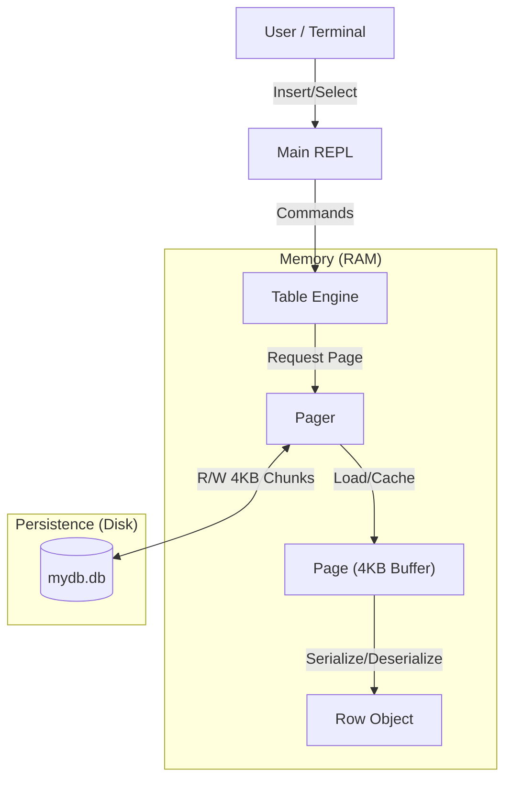

# PyMiniDB (Phase 1: The Foundation)

> **"데이터베이스의 본질(Why)을 이해하기 위한 여정"**
>
> 파이썬으로 바닥부터 구현해보는 교육용 미니 데이터베이스 엔진입니다.
> 직렬화(Serialization), 페이징(Paging), 디스크 영속성(Persistence)의 원리를 코드로 직접 구현하며 익힙니다.

---

## 🏗️ 아키텍처 개요 (Architecture Overview)

PyMiniDB는 전형적인 **Disk-Oriented Architecture**를 따릅니다.
파이썬 객체(RAM)와 파일 바이트(Disk) 사이의 간극을 명확한 계층 분리를 통해 연결합니다.



## 🧩 핵심 컴포넌트 (Core Components)

### 1. 데이터의 원자: `Row` (Data)
데이터의 최소 단위입니다. 일반적인 파이썬 객체와 달리, PyMiniDB의 Row는 **고정된 크기(Fixed Size)**를 가집니다. 이는 페이지 내에서 O(1) 시간 복잡도로 데이터 위치를 계산하기 위함입니다.

*   **스키마 (Schema)**:
    *   `id` (4 bytes, int)
    *   `username` (32 bytes, string)
    *   `email` (255 bytes, string)
*   **총 크기**: **291 Bytes**
*   **기술**: 파이썬의 `struct` 모듈과 리틀 엔디안(`lt;`) 포맷을 사용합니다.

### 2. 메모리 관리자: `Page` (Memory)
디스크 블록과 1:1로 대응되는 **4KB (4096 bytes)** 논리 단위입니다.
데이터베이스는 데이터를 스트림으로 저장하지 않고, 이렇게 페이지 단위로 나누어 관리합니다.

*   **구조**:
    *   **Header (9 bytes)**: 메타데이터 (`NumRows`, `PageType`, `FreeSpace`, `NextPageId`) 저장.
    *   **Body (4087 bytes)**: 약 14개의 Row 저장 가능.
*   **설계 경험**: "Header(9) + Body(4096)"로 인해 파일이 깨지는 정렬(Alignment) 문제를 겪었습니다. 이를 해결하기 위해 **Header를 4096바이트 규격 안에 포함**시키는 설계를 채택했습니다.

### 3. 디스크 인터페이스: `Pager` (Persistence)
파일 시스템과의 유일한 연결 통로입니다. DB 파일을 마치 '페이지들의 배열'처럼 다룹니다.

*   **기능**:
    *   `read_page(0)`: 0번 오프셋으로 이동(`seek`)하여 4096바이트를 읽음.
    *   `write_page(0)`: 4096바이트를 쓰고, 즉시 디스크에 동기화(`flush`).
*   **철학**: "파일 I/O는 OS에게 맡기고, 우리는 로직에 집중한다."

---

## 💾 바이너리 레이아웃 명세 (Binary Specification)

### Page Layout (Total 4096 Bytes)
```text
[ Header (9 Bytes) ] + [ Row 1 (291 Bytes) ] + [ Row 2 ] ... + [ Padding ]
```

### Header Format (`<HBHI`)
| Offset | Field | Type | Size | Description |
|--------|-------|------|------|-------------|
| 0 | **NumCells** | uint16 | 2 | 저장된 Row 개수 |
| 2 | **PageType** | uint8 | 1 | Leaf(0) 또는 Internal(1) |
| 3 | **FreeSpace** | uint16 | 2 | 빈 공간의 시작 오프셋 |
| 5 | **NextPageId** | uint32 | 4 | 다음 페이지 포인터 (Linked List) |
